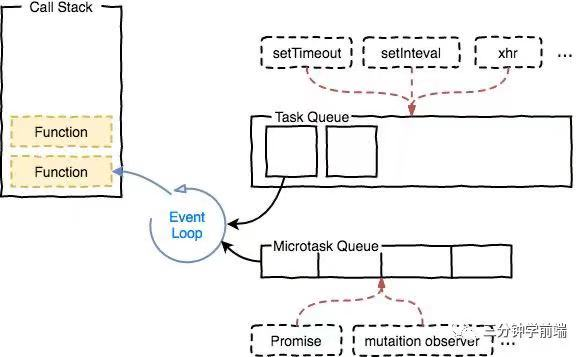
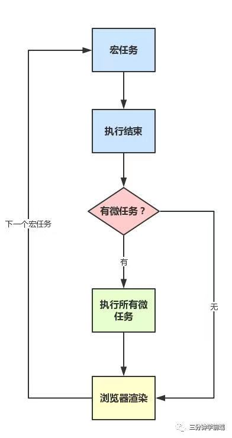
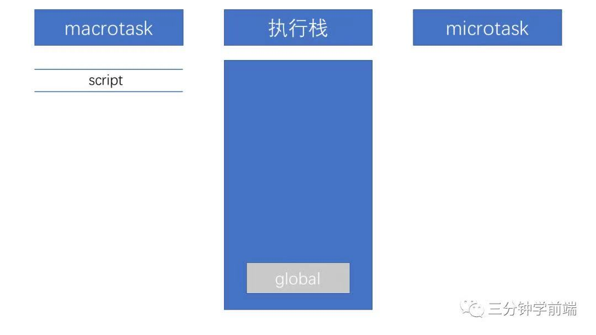
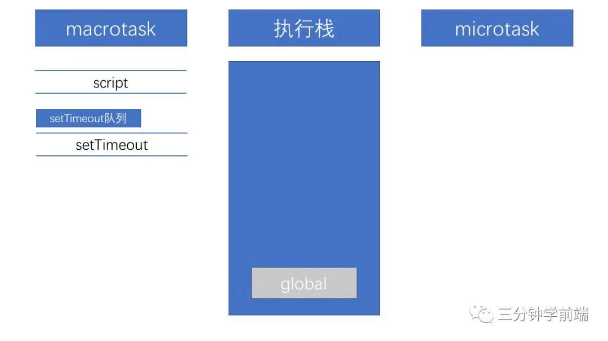
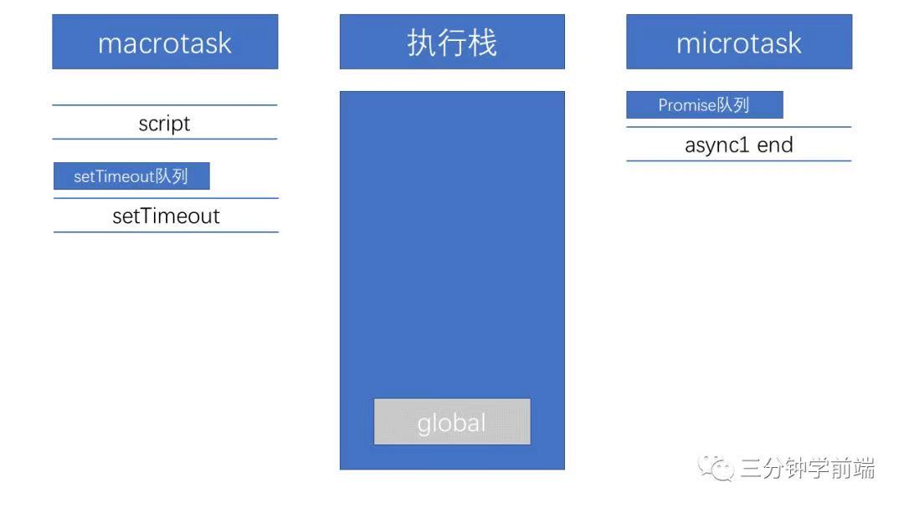

# 从一道题浅说JavaScript的事件循环
```javascript
// 请写出输出内容
async function async1 () {
    console.log('async1 start');
    await async2();
    console.log('async1 end');
}

async function async2() {
	console.log('async2');
}

console.log('script start');

setTimeout(function () {
	console.log('setTimeout');
}, 0);

async1();

new Promise(function(resolve) {
	console.log('promise1');
	resolve();
}).then(function () {
	console.log('promise2');
});

console.log('script end');
```
这道题主要考察的是事件循环中函数执行顺序的问题，其中包括**async**,**await**,**setTimeout**,**Promise**。

## 任务队列
首先我们需要明白以下几件事情：
+ JS分为同步任务和异步任务
+ 同步任务都在主线程上执行，形成一个执行栈
+ 主线程之外，事件触发线程管理着一个任务队列，只要异步任务有了运行结果，就在任务队列之中放置一个事件
+ 一旦执行栈中的所有同步任务执行完毕（此时JS引擎空闲），系统就会读取任务队列，将可运行的异步任务添加到可执行栈中，开始执行

根据规范，事件循环是通过任务队列的机制来进行协调的。一个EventLoop中，可以有一个或者多个任务队列（task queue），
一个任务队列便是一系列有序任务的集合。<br/>
**每个任务都有一个任务源（task source），源自同一个任务源的task必须放到同一个任务队列，从不同源来的则被添加到不同队列**<br/>

setTimeout/Promise等API便是任务源，而进入任务队列的是他们制定的具体执行任务



## 宏任务
（macro）task（又称之为宏任务），可以理解是每次执行栈执行的代码就是一个宏任务（包括每次从事件队列中获取一个事件回调并放到执行栈中执行）。
浏览器为了能够使得JS内部（macro）task与DOM任务能够有序的执行，会在一个(macro)task执行结束后，在下一个(macro)task执行开始前，为页面进行重新渲染

宏任务主要包含：
+ script（整体代码
+ setTimeout
+ setInterval
+ I/O
+ UI交互事件
+ postMessage
+ MessageChannel
+ setImmediate(Node.js环境)

## 微任务
microtask（又称为微任务），可以理解是在当前task执行结束后立即执行的任务。也就是说，在当前task任务后，下一个task任务前，在渲染之前。<br/>

所以它的响应速度相比setTimeout(setTimeout是task)会更快，因为无需等待渲染。也就是说，在某一个macrotask执行完后，就会将它在执行期间产生的所有microtask都执行完毕（在渲染前）<br/>

微任务主要包含：
+ Promise.then
+ MutationObserver
+ process.nextTick(Node.js环境)

## 运行机制
在事件循环中，每进行一次循环操作称为tick，每一次tick的任务处理模型是比较复杂的，但关键步骤如下：
+ 执行一个宏任务（栈中没有就从事件队列中获取）
+ 执行过程中如果遇到微任务，就将它添加到微任务的任务队列中
+ 宏任务执行完毕后，立即执行当前微任务队列中的所有微任务（依次执行）
+ 当前宏任务执行完毕，开始检查渲染，然后GUI线程接管渲染
+ 渲染完毕后，JS线程继续接管，开始下一个宏任务（从事件队列中获取）

流程图如下：<br/>


## Promise和async中的立即执行
我们知道Promise中的异步体现在then和catch中，所以写在Promise中的代码是被当做同步任务立即执行的。而在async/await中，在出现await之前，其中的代码也是立即执行。那么出现了await的时候发生了什么呢？

## await做了什么
从字面意思上看await就是等待，await等待的是一个表达式，这个表达式的返回值可以是一个promise对象也可以是其他值<br/>
很多人以为await会一直等待之后的表达式执行完之后才会继续执行后面的代码，实际上**await后面的表达式会先执行一遍，将await后的代码加入到microtask中，然后就会跳出整个async函数来执行后面的代码**<br/>
由于因为async await本身就是promise + generator的语法糖，所以await后面的代码是microtask，所以本题中的
```javascript
async function async1(){
	console.log('async1 start');
	await async2();
	console.log('async1 end');
}
```
等价于
```javascript
async function async1() {
	console.log('async1 start');
	Promise.resolve(async2()).then(() => {
		console.log('async1 end');
    })
}
```
## 回到本题
以上就是本道题涉及到的所有相关知识点，下面我们再回到这道题来一步一步看看怎么回事儿
1. 首先，事件循环是从宏任务队列开始，这个时候，宏任务队列中，只有一个script(整体代码)任务；当遇到任务源（task source）时，则会先分发任务到对应的任务队列中去，所以，上面的例子的第一步执行如下图:



2. 然后我们看到首先定义了两个async函数，接着往下看看，然后遇到了console语句，直接输出script start。输出之后，script任务继续往下执行，遇到setTimeout，其作为一个宏任务源，则会先将其任务分发到对应的队列中：



3. script任务继续往下执行，执行了async1函数，前面讲过async函数中在await之前的代码是立即执行的，所以会立即输出async1 start。遇到了await时，会将await后面的表达式执行一遍，<br/>
   所以紧接着输出async2，然后将await后面的代码也就是console.log('async1 end')加入到microtask中的Promise队列中，接着跳出async1函数来执行后面的代码



4. script任务继续往下执行，遇到Promise实例。由于Promise中的函数是立即执行的，而后续的.then则会被分发到microtask的Promise队列中去，所以会先输出promise1，然后执行resolve，将promise2分配到对应队列
   


5. script任务继续往下执行，最后只有一句输出了script end。至此全局任务就执行完毕了。根据上述，每次执行完一个宏任务之后，回去检查是否存在Microtasks；如果有，则执行Microtasks直至清空Microtask Queue.<br/>
   因而在script任务执行完毕之后，开始查找清空微任务队列。此时，微任务中，Promise队列中有两个任务async1 end和promise2，因此按先后顺序输出async1 end,promise2.当所有的Microtask执行完毕后，表示第一轮的循环就结束了
   
6. 第二轮的循环依旧从宏任务开始。此时宏任务中只有一个setTimeout，取出直接输出即可，至此，整个流程结束


